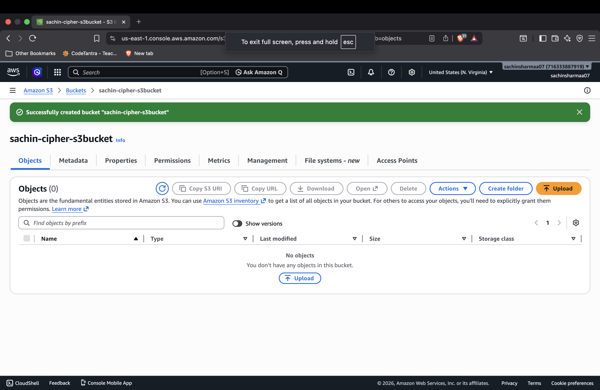
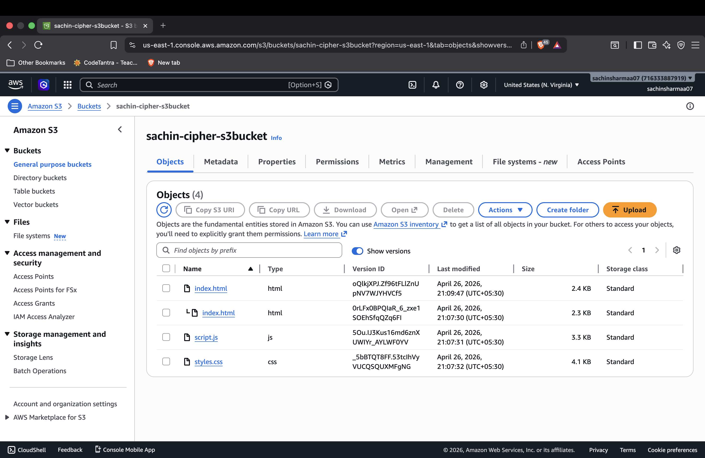
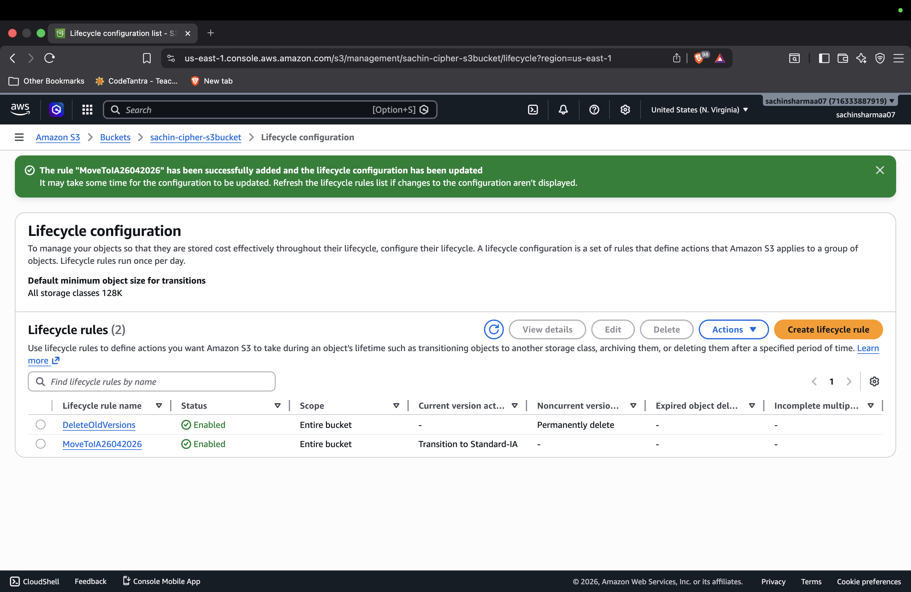
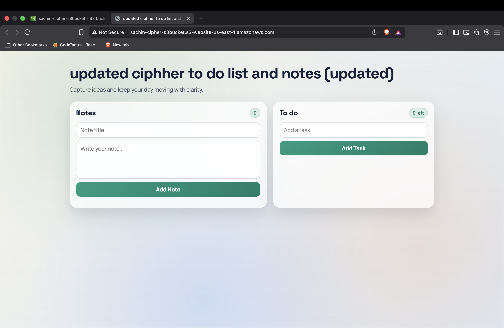

# AWS S3 Static Website Hosting with Versioning & Lifecycle Management

  <b>AWS Assignment Project</b> 
  Static website deployment using Amazon S3 with versioning and lifecycle optimization.

---

## 📌 Project Overview

This project demonstrates end-to-end implementation of **Amazon S3 static website hosting** as part of an AWS assignment. It covers:

- Creating and configuring an S3 bucket
- Hosting a static website publicly
- Enabling bucket versioning
- Uploading multiple versions of project files
- Applying lifecycle rules for storage cost optimization

The goal is to understand practical cloud deployment fundamentals and S3 storage management features used in real-world applications.

---

## ✅ Features Implemented

- **S3 Bucket Creation**
- **Static Website Hosting**
- **Versioning Enabled**
- **Multiple File Versions Uploaded**
- **Lifecycle Rules for Cost Optimization**
- **Public Website Deployment**

---

## 🛠️ Technologies Used

- **Amazon Web Services (AWS)**
- **Amazon S3**
- **HTML**
- **CSS**
- **JavaScript**
- **GitHub**

---

## 🌐 Website Link

**Live URL:**

http://sachin-cipher-s3bucket.s3-website-us-east-1.amazonaws.com/

---

## 📸 Screenshots

### 1) Bucket Created

### 2) Versioning Enabled

### 3) Multiple Versions Uploaded

### 4) Lifecycle Rules Configured

### 5) Website Running

---

## ⚠️ Challenges Faced

During this assignment, a few beginner-level challenges were encountered:

- Understanding and writing the correct **bucket policy permissions**
- Resolving **public access block** settings to make the website accessible
- Correctly configuring **static website hosting** properties in S3
- Building clear understanding of **versioning behavior** and object history

---

## 🎯 Learning Outcomes

Through this project, I learned:

- How to create and configure an S3 bucket for hosting static content
- How website endpoints work in S3 static website hosting
- How enabling versioning protects files and tracks object changes
- How lifecycle rules help optimize long-term cloud storage costs
- How to troubleshoot common deployment and permission-related issues in AWS

---

## 👨‍💻 Author

- **Name:** Sachin Kumar
- **Registration Number:** 12316496

---

## 📎 Submission Note

This README is prepared in clean GitHub Markdown format for assignment submission and documentation.
# aws-s3-static-website-assignment
